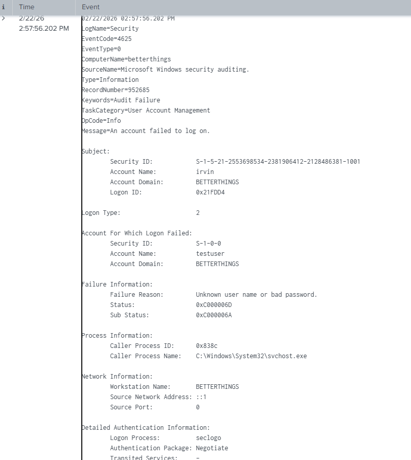

# Splunk Windows Failed Login Detection Lab

## Objective
Detect repeated Windows authentication failures using Splunk SIEM to simulate brute-force detection.

---

## Lab Environment
- Windows 11 Host Machine
- Splunk Enterprise (Free Trial)
- Windows Security Logs (WinEventLog:Security)

---

## Scenario

Multiple failed password login attempts were generated to simulate suspicious authentication behavior. 

Splunk was configured to ingest Windows Security logs and detect Event ID 4625 (failed logon events).

---

## Log Ingestion

Windows Security logs were monitored using:

WinEventLog:Security

---

## Detection Queries Used

### 1. Raw Failed Login Search

```spl
index=main EventCode=4625
```

This query retrieves all failed authentication events.

---

### 2. Aggregated Detection Logic (Brute-Force Simulation)

```spl
index=main EventCode=4625
| stats count by Account_Name, Source_Network_Address
| sort - count
```

This query:
- Counts failed login attempts
- Groups by account
- Correlates source IP
- Sorts highest failures first

---

## Key Findings

- Successfully detected Event ID 4625 in Splunk
- Correlated failed login attempts per account
- Identified source network addresses
- Demonstrated basic brute-force detection logic
- Verified proper SIEM log ingestion and parsing

---

## Security Impact

Repeated failed authentication attempts may indicate:

- Brute-force attack
- Password spraying
- Credential misuse
- Unauthorized access attempts

Monitoring failed logons is foundational in SOC operations.

---

### Raw Failed Login Events


### Event Details


### Aggregated Detection Output


### Visualization

